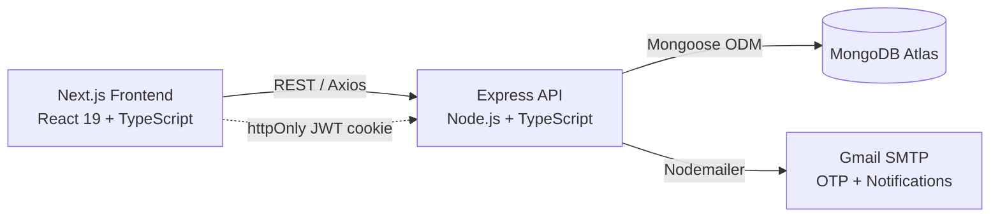

<div align="center">

# 🩺 Reliefio Health Tech

**A full-stack healthcare platform connecting patients with doctors, physiotherapists, and diagnostic labs.**


</div>

---

## 📖 Overview

Reliefio is a role-based healthcare booking platform. **Patients** can search for doctors, book appointments, order diagnostic lab tests, and view prescriptions. **Doctors** manage their schedule, consultations, and patient records. **Lab staff** manage test catalogs, sample collection, and diagnostic reports. Authentication is OTP-verified and JWT-based, with all sensitive endpoints protected by role-based middleware.

> Built as part of a web development internship, this project mirrors real ticket-based, agile-style workflows: structured REST APIs, defect tracking during development, and cross-module integration testing across the patient/doctor/lab flows.

## ✨ Features

- **Doctor Directory** — Public search and filtering by specialty; slot-based appointment booking.
- **Appointments** — Create, reschedule, cancel, and track appointments across patient and doctor views.
- **Consultations** — Doctors record diagnosis and notes tied to a completed appointment.
- **Prescriptions** — Doctors issue prescriptions; patients view their full prescription history.
- **Diagnostic Labs** — Browse public test catalogs, place orders, track sample collection through to final report.
- **Reviews** — Patients leave ratings and reviews for doctors.
- **Notifications** — In-app notification feed with read/unread and mark-all-read.
- **Auth & Security** — OTP email verification on signup, JWT stored in an httpOnly cookie, bcrypt password hashing, forgot/reset/change password flows.
- **Role-Based Access Control** — Every protected route enforces `Patient`, `Doctor`, or `Lab` role checks server-side.

## 🏗️ Architecture



## 🛠️ Tech Stack

| Layer | Technologies |
|---|---|
| **Frontend** | Next.js 16 (App Router), React 19, TypeScript, Tailwind CSS 4, Axios |
| **Backend** | Node.js, Express 5, TypeScript |
| **Database** | MongoDB, Mongoose ODM |
| **Auth** | JSON Web Tokens (httpOnly cookie), bcrypt, OTP email verification |
| **Email** | Nodemailer (Gmail SMTP) |
| **Validation** | express-validator |

## 📁 Project Structure

```
Reliefio_Health_Tech_Project/
├── frontend/                  # Next.js app
│   ├── app/                   # App Router pages
│   ├── Components/            # Reusable UI components
│   ├── services/              # Axios calls per module (auth, doctors, labs, ...)
│   ├── lib/axios.ts           # Configured Axios instance
│   └── types/                 # Shared TypeScript types
│
└── backend/                   # Express API
    └── src/
        ├── config/            # DB and mail configuration
        ├── controllers/       # Request handlers
        ├── middleware/        # Auth guard, role guard, error handler
        ├── models/            # Mongoose schemas
        ├── routes/            # Express route definitions
        ├── services/          # Business logic (email, notifications, slots)
        ├── utils/             # Helpers (tokens, OTP, API responses)
        └── server.ts          # Entry point
```

## 📡 API Reference

All routes are prefixed with `/api`. 🔓 = public · 🔐 = logged in · 🩺 = Doctor role · 🧪 = Lab role

<details>
<summary><strong>Auth</strong> — <code>/api/auth</code></summary>

| Method | Endpoint | Access |
|---|---|---|
| POST | `/signup` | 🔓 |
| POST | `/verify-otp` | 🔓 |
| POST | `/login` | 🔓 |
| POST | `/logout` | 🔓 |
| POST | `/forgot-password` | 🔓 |
| POST | `/reset-password` | 🔓 |
| GET | `/me` | 🔐 |
| PUT | `/change-password` | 🔐 |

</details>

<details>
<summary><strong>Doctors</strong> — <code>/api/doctors</code></summary>

| Method | Endpoint | Access |
|---|---|---|
| GET | `/` | 🔓 |
| GET | `/specialties` | 🔓 |
| GET | `/:id` | 🔓 |
| GET | `/:id/slots` | 🔓 |
| POST | `/` | 🩺 |
| PUT | `/:id` | 🩺 |
| DELETE | `/:id` | 🩺 |

</details>

<details>
<summary><strong>Appointments</strong> — <code>/api/appointments</code></summary>

| Method | Endpoint | Access |
|---|---|---|
| POST | `/` | 🔐 |
| GET | `/` | 🔐 |
| GET | `/:id` | 🔐 |
| PUT | `/:id` | 🔐 |
| DELETE | `/:id` | 🔐 |

</details>

<details>
<summary><strong>Consultations</strong> — <code>/api/consultations</code></summary>

| Method | Endpoint | Access |
|---|---|---|
| POST | `/` | 🩺 |
| GET | `/appointment/:appointmentId` | 🔐 |
| GET | `/:id` | 🔐 |
| PUT | `/:id` | 🩺 |

</details>

<details>
<summary><strong>Prescriptions</strong> — <code>/api/prescriptions</code></summary>

| Method | Endpoint | Access |
|---|---|---|
| POST | `/` | 🩺 |
| GET | `/mine` | 🩺 |
| GET | `/patient/:patientId` | 🔐 |
| GET | `/single/:id` | 🔐 |
| PUT | `/:id` | 🩺 |

</details>

<details>
<summary><strong>Lab</strong> — <code>/api/lab</code></summary>

| Method | Endpoint | Access |
|---|---|---|
| GET | `/tests/public` | 🔓 |
| GET | `/reports/:id` | 🔐 |
| GET | `/my-orders` | 🔐 |
| GET | `/dashboard` | 🧪 |
| GET/POST/PUT/DELETE | `/tests`, `/tests/:id` | 🧪 |
| GET/POST/PUT | `/orders`, `/orders/:id` | 🧪 |
| GET/POST/PUT | `/samples`, `/samples/:id` | 🧪 |
| GET/POST/PUT | `/reports`, `/reports/:id` | 🧪 |
| GET | `/patients`, `/patients/search` | 🧪 |
| GET/PUT | `/profile` | 🧪 |

</details>

<details>
<summary><strong>Physician Portal</strong> — <code>/api/physician</code></summary>

| Method | Endpoint | Access |
|---|---|---|
| GET | `/dashboard` | 🩺 |
| GET | `/appointments` | 🩺 |
| GET | `/patients`, `/patients/:id` | 🩺 |
| GET/PUT | `/profile` | 🩺 |
| GET/PUT | `/availability` | 🩺 |

</details>

<details>
<summary><strong>Reviews & Notifications</strong></summary>

| Method | Endpoint | Access |
|---|---|---|
| GET | `/api/reviews` | 🔓 |
| GET | `/api/reviews/mine` | 🔐 |
| POST | `/api/reviews` | 🔐 |
| GET | `/api/notifications` | 🔐 |
| PUT | `/api/notifications/:id/read` | 🔐 |
| PUT | `/api/notifications/read-all` | 🔐 |

</details>

## 🚀 Getting Started

### Prerequisites
- Node.js 20+
- A MongoDB connection string ([MongoDB Atlas](https://mongodb.com/atlas) free tier works)
- A Gmail account with an [App Password](https://myaccount.google.com/apppasswords) for sending OTP emails

### 1. Clone and install
```bash
git clone https://github.com/<your-username>/<your-repo>.git
cd <your-repo>

cd backend && npm install
cd ../frontend && npm install
```

### 2. Configure environment variables

**`backend/.env`** (see `backend/.env.example`)
```env
MONGODB_URI=mongodb+srv://<user>:<password>@<cluster>.mongodb.net/reliefio
JWT_SECRET=your_long_random_secret
CLIENT_URL=http://localhost:3000
EMAIL_USER=youraddress@gmail.com
EMAIL_PASS=your_16_char_app_password
NODE_ENV=development
PORT=5000
```

**`frontend/.env.local`** (see `frontend/.env.example`)
```env
NEXT_PUBLIC_API_URL=http://localhost:5000/api
```

### 3. Run locally
```bash
# Terminal 1 — backend
cd backend
npm run dev        # http://localhost:5000

# Terminal 2 — frontend
cd frontend
npm run dev         # http://localhost:3000
```

### 4. (Optional) Seed sample data
```bash
cd backend
npm run seed
```

## ☁️ Deployment

This project is designed to run entirely on free-tier infrastructure:

| Component | Platform |
|---|---|
| Frontend | [Vercel](https://vercel.com) |
| Backend | [Render](https://render.com) (Web Service, free tier) |
| Database | [MongoDB Atlas](https://mongodb.com/atlas) (M0 free cluster) |

Backend build/start commands: `npm install && npm run build` / `npm start`. Set the same environment variables listed above on Render, and `NEXT_PUBLIC_API_URL` (pointing at the deployed backend + `/api`) on Vercel.

> **Note:** the free Render tier spins down after 15 minutes of inactivity — the first request after idle time can take 30–60s to respond.

## 🔐 Roles

| Role | Capabilities |
|---|---|
| `Patient` | Browse doctors/labs, book appointments and lab tests, view own prescriptions and reports, leave reviews |
| `Doctor` | Manage profile & availability, view patients, run consultations, issue prescriptions |
| `Lab` | Manage test catalog, process orders and samples, publish diagnostic reports |

## 📄 License

This project is currently unlicensed and intended for personal/portfolio use. Add an open-source license (e.g. MIT) if you plan to make it publicly reusable.
